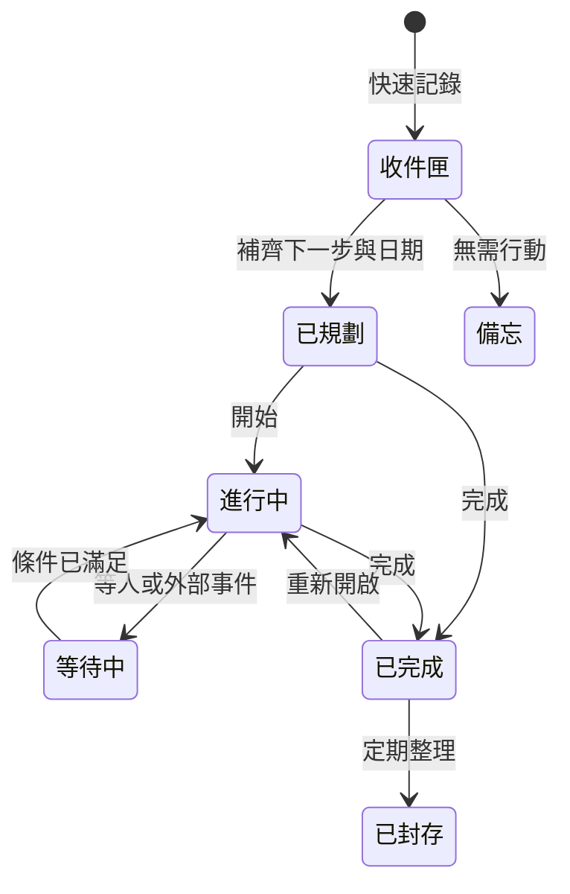

# 代辦記憶庫：產品與功能設計 v0.1

## 1. 產品定位

這不是另一個複雜的專案管理工具，而是一個手機優先的「行動記憶庫」：讓使用者在 5 秒內記下事情，之後再逐步補齊，並能清楚看見今天該做什麼、什麼正在等待、什麼已經延誤，以及每件事如何演化。

### 設計原則

1. **先記下，再整理**：快速輸入只要求一句話，其他欄位都可稍後補。
2. **每件事都要有下一步**：模糊想法可以存在，但進入執行前必須形成明確動作。
3. **狀態少而明確**：避免大量自訂欄位與層級。
4. **事件不可失憶**：每次建立、修改、延期、完成、匯入與 AI 協助都留下紀錄。
5. **戰情只呈現異常與焦點**：首頁不做資料倉庫，而是做決策入口。
6. **本機優先**：第一階段資料保存在瀏覽器；匯出檔是使用者可攜的資料主權副本。

## 2. 最小可用版本範圍

### 第一階段：純前端

- 響應式單頁應用程式，手機優先，可安裝為 PWA。
- IndexedDB 儲存；不需要登入、不連接伺服器。
- JSON 完整備份／還原，另提供 CSV 任務清單匯出。
- 快速收件匣、今日戰情、任務明細、搜尋、事件時間軸。
- 應用程式開啟時的到期提醒與瀏覽器通知（視裝置權限與支援度）。
- 可匯出 `.ics` 行事曆事件，交由手機原生行事曆負責可靠提醒。

### 第一階段不宣稱的能力

- 瀏覽器或 PWA 完全關閉後，iOS/Android 都能準時背景提醒。
- 跨裝置即時同步、多人協作、帳號權限與雲端復原。
- 未經使用者同意把任務內容傳送到 LLM。

### 第二階段：後端／同步

- 帳號與多裝置同步。
- Web Push／Email／Teams 等可靠通知管道。
- 版本衝突處理、伺服器備份與稽核。
- 可選的 Azure OpenAI 結構化整理服務。

## 3. 記憶方法：一句話收件匣 + 漸進式整理

首頁底部永遠保留一個「＋記一件事」按鈕。點擊後只顯示：

- 必填：`想到什麼？`（自然語句）
- 選填捷徑：`今天`、`明天`、`日期`、`等待他人`、`加入照片/連結`

儲存後立即產生一筆 `inbox` 任務，不要求使用者先選專案、分類或優先級。稍後透過「整理收件匣」一次處理一件：

1. 這件事需要行動嗎？否則轉為備忘或封存。
2. 下一個可見動作是什麼？
3. 何時需要再次看到它？
4. 是否等待某人／某事？
5. 是否屬於某個主題或父任務？

建議只保留四種重要性：`焦點`、`一般`、`低`、`未判定`；不使用容易混淆的 1–10 分。

## 4. 任務生命週期與動態節點



### 節點不是畫圖元件，而是可追蹤的動作

每個任務由三種資料共同描述：

- `Task`：現在的真實狀態，用於快速查詢與畫面呈現。
- `Relation`：任務、備忘、人員或主題之間的有向連結。
- `Event`：只新增、不覆寫的演化紀錄，回答「何時、誰、做了什麼、從什麼變成什麼」。

### 關係類型

- `parent_of`：主任務與子任務。
- `blocks`：A 完成前 B 不能開始。
- `waiting_for`：等待某人或某外部事件。
- `related_to`：只有參考關係，不影響狀態。
- `derived_from`：由某筆備忘、匯入或 AI 建議衍生。

為維持手機操作簡單，關係只在任務明細的「關聯」區塊編輯；首頁不直接顯示複雜節點圖。

### 產品靈魂：結構可以深，操作必須淺

- 首頁只回答「現在要注意什麼」與「下一步是什麼」，不要求使用者先建立完整專案樹。
- 新資料先進收件匣；專案、關係、里程碑皆為漸進整理，不阻擋快速記錄。
- 提醒預設關閉且一次只提醒一次；專案層優先使用定期檢視，不替每個節點製造通知。
- 複雜結構收在明細或專案戰情，日常操作維持記下、排程、完成、延後四個主要動作。

## 5. 資料結構

```ts
type TaskStatus =
  | "inbox" | "planned" | "active" | "waiting"
  | "done" | "archived" | "note";

interface Task {
  id: string;                 // UUID
  title: string;
  note?: string;
  nextAction?: string;
  status: TaskStatus;
  importance: "focus" | "normal" | "low" | "unset";
  dueAt?: string;             // ISO 8601；真正截止時間
  remindAt?: string;          // 何時再顯示
  waitingFor?: string;
  projectId?: string;         // 可選；不要求每筆任務都屬於專案
  milestoneId?: string;       // 可選；保留階段／里程碑擴充
  tags: string[];
  createdAt: string;
  updatedAt: string;
  completedAt?: string;
  version: number;
}

interface Project {
  id: string;
  title: string;
  outcome?: string;           // 完成後要得到的結果
  status: "active" | "waiting" | "done" | "archived";
  nextReviewAt?: string;      // 專案以檢視節奏取代大量節點提醒
  dueAt?: string;
  tags: string[];
  createdAt: string;
  updatedAt: string;
  version: number;
}

interface Relation {
  id: string;
  fromId: string;
  toId: string;
  type: "parent_of" | "blocks" | "waiting_for" | "related_to" | "derived_from";
  createdAt: string;
}

interface Event {
  id: string;
  entityId: string;
  type: "created" | "edited" | "status_changed" | "reminder_changed"
      | "relation_added" | "relation_removed" | "completed" | "reopened"
      | "imported" | "exported" | "ai_suggested" | "ai_applied";
  at: string;
  actor: "user" | "system" | "ai" | "import";
  summary: string;            // 適合人閱讀的短句
  patch?: Record<string, { before: unknown; after: unknown }>;
  correlationId?: string;     // 一次批次操作共用
}
```

現階段 IndexedDB 使用 `tasks`、`relations`、`events`、`settings`；專案介面成熟後再以資料庫升級加入 `projects`，避免為尚未使用的結構增加操作負擔。Task 先保留可選的 `projectId`、`milestoneId`，舊資料不需轉換。匯出格式包含 `schemaVersion`、`exportedAt`、資料集合與 SHA-256 校驗摘要；匯入前先預覽新增／覆蓋／衝突筆數，不直接改寫現有資料。

## 6. 每個動作放在哪裡

| 動作 | 手機位置 | 操作結果 | 必留紀錄 |
|---|---|---|---|
| 快速記錄 | 全站右下浮動按鈕 | 建立收件匣項目 | `created` |
| 完成 | 任務卡左側勾選 | 狀態改為完成 | `completed` |
| 延後再看 | 任務卡右滑或更多選單 | 更新 `remindAt` | `reminder_changed` |
| 開始／等待 | 任務明細主按鈕 | 改變狀態 | `status_changed` |
| 編輯內容 | 任務明細標題／欄位 | 局部更新 | `edited` + 欄位差異 |
| 新增關係 | 任務明細「關聯」 | 建立 Relation | `relation_added` |
| 查看演化 | 任務明細「時間軸」 | 只讀事件清單 | 不新增事件 |
| 匯入／匯出 | 設定 → 資料 | 產生或讀取備份 | `imported`／`exported` |
| AI 整理 | 收件匣單筆「協助整理」 | 先顯示建議，不自動套用 | `ai_suggested`、確認後 `ai_applied` |

## 7. 提醒設計

提醒分成四層，讓使用者清楚知道「現在為什麼看到它」：

1. **逾期**：紅色，只代表已超過真正截止時間。
2. **今天**：高對比主區，包含今日截止與今日提醒。
3. **等待追蹤**：琥珀色，顯示等待對象與已等待天數。
4. **即將到來**：未來 7 天，低干擾呈現。

每張卡片只顯示：狀態、標題、下一步、時間理由。例：`今天 16:00 截止`、`已等待王先生 4 天`，不只放一個沒有語意的日期。

### 純前端的可靠提醒策略

- 應用程式開啟時：可靠執行本地規則，更新角標、首頁與通知。
- 瀏覽器通知：只有在瀏覽器／PWA 與作業系統允許時提供，不能保證背景準時。
- 需要準時提醒的任務：提供「加入手機行事曆」匯出 `.ics`。
- `.ics` 使用穩定 UID、版本序號與原任務網址；從行事曆可回到 `#task=<id>` 的任務明細。
- 行事曆連結只攜帶不透明任務 ID，不把標題或筆記放進網址。
- 單次下載的 `.ics` 不是即時同步；未來要即時更新需提供可訂閱行事曆或後端同步 API。
- 第二階段：後端排程 + Web Push，並顯示通知已排程／已送達／失敗狀態。

## 8. 手機戰情首頁

```text
┌──────────────────────────┐
│ 8/12 週三          搜尋  ⚙ │
│ 早安，今天先完成 2 件焦點  │
├──────────────────────────┤
│ [逾期 2] [今天 5] [等待 3] │
├──────────────────────────┤
│ 焦點                              │
│ ○ 提交月報                        │
│   下一步：確認最後兩筆數字         │
│   今天 16:00 截止                 │
│                                  │
│ ○ 回覆供應商                      │
│   已等待王先生 4 天                │
├──────────────────────────┤
│ 收件匣有 6 件尚未整理  [開始整理] │
├──────────────────────────┤
│ 今日完成 3/5   本週延誤 +1         │
├──────────────────────────┤
│ 戰情       記憶       時間軸       │
│                 ＋記一件事         │
└──────────────────────────┘
```

### 底部導覽只保留三區

- **戰情**：今天要決定與處理的事。
- **記憶**：收件匣、全部任務、備忘、標籤與搜尋。
- **時間軸**：跨任務的活動與演化，可依日期／動作篩選。

任務明細採由下往上滑出的全螢幕 sheet，避免手機上多層頁面跳轉。新增動作固定在拇指容易觸及的右下區域；危險操作收在更多選單並要求確認。

## 9. Azure OpenAI 的角色與邊界

LLM 是選用的整理助手，不是資料庫，也不直接改任務。適合：

- 把自然語句建議成 `標題／下一步／日期／等待對象／標籤`。
- 把一組子任務摘要成進度與風險。
- 發現模糊描述並提出一個澄清問題。

不應交給 LLM：到期判斷、排序規則、提醒觸發、資料合併、狀態轉移與稽核紀錄；這些必須用本地確定性規則。

### 資料保護

- 預設關閉，單次送出前顯示實際將傳送的文字。
- 啟用 Azure 表示內容會離開本機，必須取得使用者明確同意。
- API 金鑰不能放在純前端；Azure 串接必須透過第二階段後端代理。
- 回傳必須通過 JSON Schema 驗證，先以建議卡呈現，由使用者確認後才套用。
- Event 必須分開記錄 `ai_suggested` 與 `ai_applied`，不可把建議偽裝成使用者原始內容。

## 10. 二階 API 草案

```text
POST   /api/v1/sync/push          上傳本機事件批次
POST   /api/v1/sync/pull          依 cursor 取得遠端事件
POST   /api/v1/backups            建立加密備份
GET    /api/v1/backups/:id        下載備份
POST   /api/v1/reminders          排程通知
DELETE /api/v1/reminders/:id      取消通知
GET    /api/v1/calendar/:token.ics 提供唯讀可訂閱行事曆，讓任務更新反映到行事曆
POST   /api/v1/ai/organize        產生結構化建議
```

同步以事件為主、Task 快照為讀取模型。每個寫入帶 `deviceId`、`eventId`、`baseVersion` 與冪等鍵；版本衝突不可靜默覆蓋，應產生「保留本機／採用遠端／手動合併」選項。

## 11. 驗收標準

第一階段完成必須同時符合：

1. 手機寬度 360 px 下，5 秒內可建立一筆任務。
2. 離線重新開啟後資料仍在，重新整理不遺失。
3. 所有新增、編輯、狀態、提醒、關係與匯入動作都有 Event。
4. 今日首頁能正確區分逾期、今天、等待與未來 7 天。
5. JSON 匯出後，在全新瀏覽器資料庫可完整還原且校驗通過。
6. 匯入前顯示差異，取消匯入時資料零變更。
7. 未啟用 AI 時不發出任何任務內容的網路請求。
8. 瀏覽器不支援背景提醒時，UI 必須明說限制並提供 `.ics` 替代。
9. 主要動作可單手操作，觸控目標至少 44 × 44 px。
10. 中文內容通過 UTF-8 檢查，且實際頁面無亂碼。

## 12. 建議實作順序

1. 靜態手機原型：戰情、快速記錄、任務明細、時間軸。
2. IndexedDB 與事件紀錄核心。
3. 今日／逾期／等待規則與搜尋。
4. JSON 匯出、差異預覽、還原與 `.ics`。
5. PWA、通知權限與離線驗證。
6. 確認第一階段實際使用習慣後，再設計同步後端與 Azure OpenAI 代理。

## 13. 需要對焦的三個決策

1. **任務模型**：採本文件的簡化狀態，或需要支援專案／清單的第二層分類？
2. **提醒策略**：第一階段接受「應用內 + 行事曆」；若要求關閉 App 仍準時推播，需直接把最小後端納入範圍。
3. **下一步交付**：先做可點擊的手機視覺原型，確認操作後再接 IndexedDB；或直接做可用 MVP。
